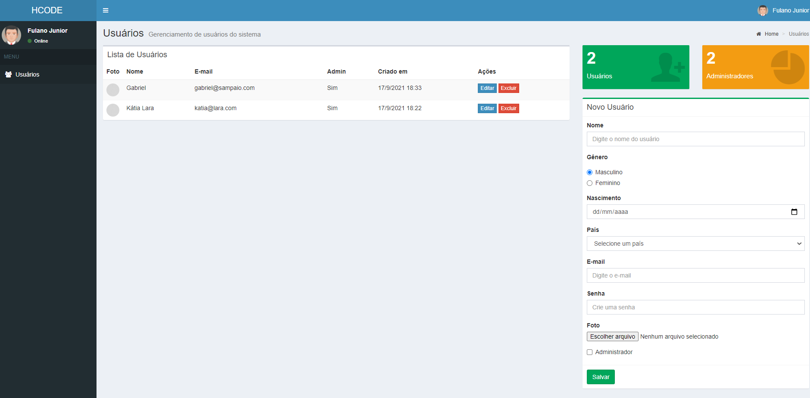

# Gerenciamento de Usuários - Template Admin - crud-full-hcode



Projeto foi desenvolvido de acordo com o curso de Javascript da <a href="https://www.hcode.com.br">HCODE</a>. Usamos o Template Admin com a opção de cadastrar usuários. Este projeto possui um Frontend separado do Backend, melhores informações abaixo.


## Instalação de Dependências Frontend.

Instale o BOWER globalmente, através do seguinte comando: 
```
- npm install -g bower
```

Entre na pasta do frontend para instalar o bower no projeto. 
```
- bower install 
```

Para iniciar o projeto, digite:
```
- npm start 
```

(Port:3000)

## Instalação de Dependências Backend.

Instale as dependências do package.json através do comando:
```
- npm install
```

Para iniciar o servidor, digite: 
```
- node index 
```

(Port:4000)

## API Restful 

API desenvolvida em Node.js para o Curso Completo de JavaScript na Udemy.com

```
## Rotas
Obter todos os usuários:
```
GET /users
```
Exemplo de resultado:
```json
{
    "users":[]
}
```

Cadastrar um novo usuário:
```
POST /users
```
Exemplo de resultado:
```json
{
    "_id":"hjkhfui324",
    "name":"João Rangel"
}
```

Obter dados de um usuário:
```
GET /users/:id
```
Exemplo de resultado:
```json
{
    "_id":"hjkhfui324",
    "name":"João Rangel"
}
```

Editar um usuário:
```
PUT /users/:id
```
Exemplo de resultado:
```json
{
    "_id":"hjkhfui324"
}
```

Excluir um usuário:
```
DELETE /users/:id
```
Exemplo de resultado:
```json
{
    "_id":"hjkhfui324"
}
```
